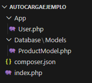
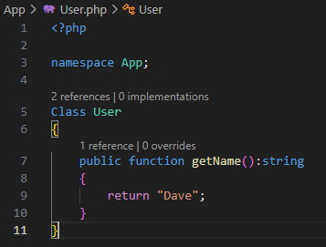
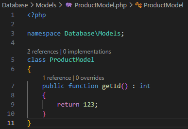
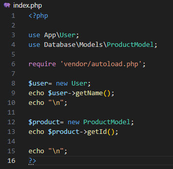
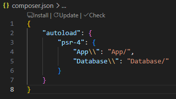
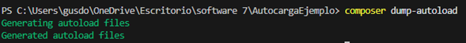
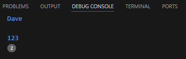

# Laboratorio #4 - Autoload PSR-4 con Composer

## Introducción

Este laboratorio consiste en implementar el estándar PSR-4 en PHP utilizando Composer para la carga automática de clases, eliminando el uso de include y require manuales.

El objetivo es organizar correctamente el código mediante namespaces y estructuras de carpetas, siguiendo las buenas prácticas recomendadas por los estándares PSR.
 

## Requisitos

- <a href="https://www.php.net/" target="_blank">
   PHP 8
  </a>  

- <a href="https://getcomposer.org/" target="_blank">
   Composer
  </a>  

- <a href="https://laravel.com/" target="_blank">
   Laravel
  </a>  

- <a href="https://www.mysql.com/" target="_blank">
   MySQL
  </a>  

- <a href="https://code.visualstudio.com/" target="_blank">
   Visual Studio Code
  </a>  

- <a href="https://www.npmjs.com/" target="_blank">
   NPM
  </a>  

- Sistema Operativo: Windows 10 o superior 

## Comandos utilizados

composer create-project laravel/laravel miProyecto  
composer require laravel/breeze --dev  
php artisan breeze:install  
npm install  
npm run dev  
php artisan migrate  
php artisan serve  

## Estructura de archivos

```
AutocargaEjemplo/ 
├── App/ 
│ └── User.php 
│ 
├── Database/ 
│ ├── Models 
|   └──ProductModel.php
|
├── composer.json
|
└── index.php
```


## Pruebas de ejecución

Codigo de User.php



Codigo de ProductModel.php



Codigo Index.php



Codigo Composer.json



Composer dump-autoload



Ejecución



## Dificultades y Soluciones

### Problema 1: Class not found
Las clases no eran reconocidas por PHP.

**Solución:**  
Se ejecutó el comando composer dump-autoload para regenerar el mapa de clases.

### Problema 2: Namespace incorrecto
Las clases no coincidían con la estructura de carpetas.

**Solución:**  
Se corrigió el namespace para que reflejara exactamente la ubicación del archivo.

## Conclusiones Técnicas

### Análisis Comparativo

Durante el desarrollo del laboratorio se identificaron las siguientes ventajas al utilizar el estándar PSR-4 con Composer:

- **Mantenibilidad:** Facilita la incorporación de nuevas clases sin necesidad de modificar archivos de configuración globales. La organización basada en namespaces mejora la escalabilidad y el mantenimiento del proyecto.

- **Eficiencia de Memoria:** Gracias al Lazy Loading (carga bajo demanda), las clases son cargadas únicamente cuando se requieren, optimizando el consumo de recursos y mejorando el rendimiento del servidor.

- **Estandarización:** La implementación del estándar PSR-4 permite una estructura uniforme y comprensible, facilitando el trabajo colaborativo entre desarrolladores y reduciendo errores relacionados con la organización del código.

## Referencias

- https://laravel.com/docs  
- https://www.php.net/  
- https://getcomposer.org/  

## Fecha de Ejecución

5 de mayo de 2026

---

Este laboratorio ha sido desarrollado por el estudiante de la Universidad Tecnológica de Panamá:

Nombre: Gustavo Domínguez  
Correo: gustavo.dominguez1@utp.ac.pa  
Curso: Desarrollo de Software VII  
Instructor del Laboratorio: Irina Fong  
